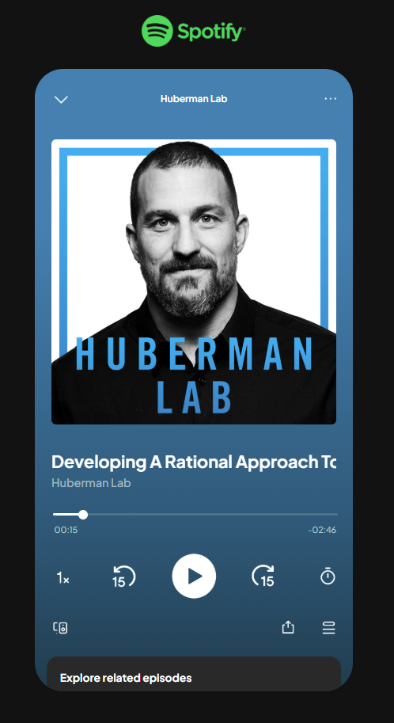

# 🎧 Online Podcast Player Interface
This project includes custom-built podcast player interfaces I created for a UX research study at NJIT. 

**Goal**: Explore how different formats (audio vs. video), imagery, and delivery styles affect how people engage with podcasts ads online.

As part of a 2x2x3 experimental design, I built 12 different versions of a podcast player that looked and felt like Spotify's interface. Participants were randomly assigned to one of these versions during the study, which was run entirely online.

## Set Up
- 12 total versions (6 versions used audio only and 6 used video)
- Some versions included a visible logo from the sponsor
- Built using HTML, CSS, JS and hosted on Github Pages

## Examples

[Audio Version w/o Visible Logo](https://podcast-ctrl.github.io/online-podcast-player/audio-podcast/audnol1)

[Video Version w/ Visible Logo](https://podcast-ctrl.github.io/online-podcast-player/video-podcast/vidlog1)

## Features
- Custom playback controls (forward, rewind, speed toggle)
- Additional icons similar to Spotify (sleep timer, share, queue, etc.)
- Responsive layout for desktop and mobile
- Playback manipulation restricted until after first watch to ensure participation

